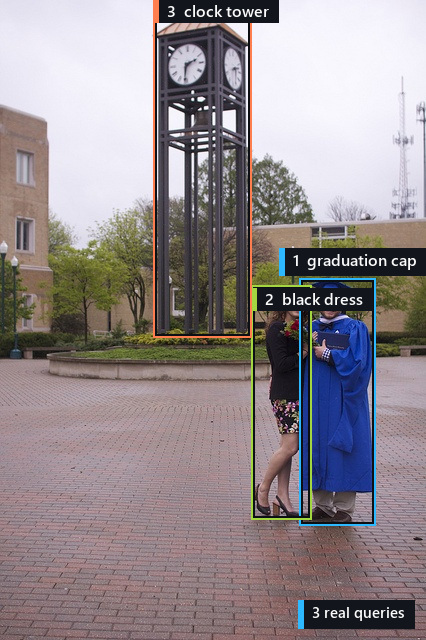
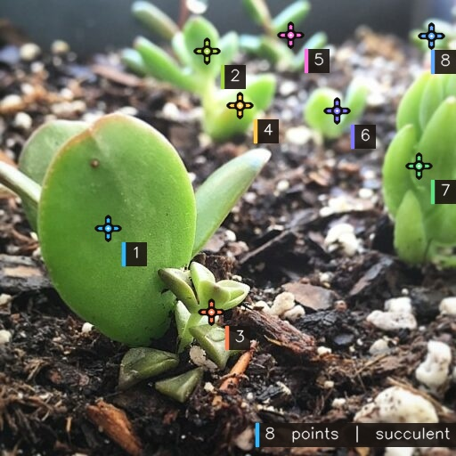

English | [简体中文](./README_ZH.md)

# Locateanything_PTQ


<p align="center">
  
</p>

`Locateanything_PTQ` converts LocateAnything-3B into W8 HBM models for the
D-Robotics RDK S600. It includes calibration, PTQ, BC/HBO/HBM compilation, and
a standalone C++ Console.

## Supported tasks

| Command | Task |
| --- | --- |
| `/detect person,car` | Open-vocabulary detection |
| `/ground <phrase>` | Referring grounding |
| `/ground_single <phrase>` | Single-instance grounding |
| `/gui <element>` | GUI point grounding |
| `/gui_box <element>` | GUI box grounding |
| `/text` | OCR |
| `/ground_text <text>` | Text grounding |
| `/layout title,table,figure` | Document layout grounding |
| `/point <target>` | Point localization |

## Model and quantization

<p align="center">
  
</p>

| Item | Configuration |
| --- | --- |
| Model | LocateAnything-3B |
| Vision | MoonViT, 27 blocks, `672 x 672` |
| Language | Qwen2.5 decoder, 36 layers, hidden size 2048 |
| Quantization | Vision W8, Language W8, LM Head W8 |
| Calibration | 1,200 images, dynamic activation quantization |
| Prefill / KV cache | 1024 / 4096 tokens |
| Decode | PBD q=6, AR q=1, host sampling |
| Target | Nash-P, four BPU cores, L2 `6:6:6:6` |

## Environment

| Item | Requirement |
| --- | --- |
| Build host | Linux x86_64, NVIDIA GPU, CUDA |
| SDK | D-Robotics LLM S600 SDK 1.0.5 |
| Python | Python 3.10, PyTorch |
| Target | RDK S600, AArch64 |

## Build

### 1. Clone the repository

```bash
git clone https://github.com/LiuAnclouds/Locateanything_PTQ.git
cd Locateanything_PTQ
```

### 2. Install the OELLM SDK

```bash
cd ..
wget https://d-robotics-aitoolchain.oss-cn-beijing.aliyuncs.com/llm_s600/1.0.5/D-Robotics_LLM_S600_1.0.5_SDK.tar.gz
tar -xzf D-Robotics_LLM_S600_1.0.5_SDK.tar.gz
cd D-Robotics_LLM_S600_1.0.5_SDK/oellm_build
python -m pip install -r requirements.txt
python -m pip install hbdk4_compiler-*.whl leap_llm-*.whl

cd ../../Locateanything_PTQ
python -m pip install -r compiler/requirements-host.txt
```

### 3. Download LocateAnything-3B

```bash
export HF_ENDPOINT="https://hf-mirror.com"

hf download nvidia/LocateAnything-3B \
  --local-dir compiler/models/LocateAnything-3B
```

### 4. Download calibration data

```bash
mkdir -p compiler/datasets/calibration/locateanything/source

hf download xkj521999/OE_LA_Calibration_data source.zip \
  --repo-type dataset \
  --local-dir compiler/datasets/calibration/locateanything

unzip -qo \
  compiler/datasets/calibration/locateanything/source.zip \
  -d compiler/datasets/calibration/locateanything/source
```

### 5. Build HBM

```bash
python compiler/quantize.py \
  --config compiler/config/quantization.yaml \
  prepare

python compiler/quantize.py \
  --config compiler/config/quantization.yaml \
  calibrate --component all

python compiler/quantize.py \
  --config compiler/config/quantization.yaml \
  build --component all --target hbm
```

## Standalone Console

Prepare the generated models and tokenizer:

```bash
mkdir -p inference/models/tokenizer

cp compiler/outputs/chunk1024_cache4096_w8/build/vision/LocateAnything-3B_vision.hbm \
  inference/models/
cp compiler/outputs/chunk1024_cache4096_w8/build/language/LocateAnything-3B_language.hbm \
  inference/models/
cp compiler/outputs/chunk1024_cache4096_w8/build/language/LocateAnything-3B_embed_tokens.bin \
  inference/models/
cp compiler/models/LocateAnything-3B/{vocab.json,merges.txt,added_tokens.json} \
  inference/models/tokenizer/
```

Copy the repository to RDK S600, then build and start the Console:

```bash
cmake -S inference -B inference/build -DCMAKE_BUILD_TYPE=Release
cmake --build inference/build --parallel 2
./inference/build/console --config inference/config.yaml
```

```text
[User] <<< /image <image-path>
[User] <<< /detect person,car,bicycle
```

Image results are saved as `annotated.jpg` and `prediction.json`. Video
results are saved as `annotated.mp4`, `predictions.jsonl`, and
`summary.json` under `inference/outputs/<input-name>/`.

## Results

### Examples

Object detection, `/detect person,bus,bicycle`


GUI grounding, `/gui_box Go to file/function; Environment tab; Files tab`


Referring grounding, `/ground person wearing a graduation cap; woman in a black dress; clock tower`



OCR, `/text`


Text grounding, `/ground_text LIVE love LAUGH; laugh giggle be silly; Yes Virginia`


Document layout, `/layout plot,text`


Point localization, `/point succulent`



### Performance

| Task | Output tokens | Vision (ms) | Prefill (ms) | Decode (ms) | Total (ms) | Decode (tokens/s) |
| --- | ---: | ---: | ---: | ---: | ---: | ---: |
| Object detection | 47 | 252.5 | 149.9 | 525.0 | 970.5 | 89.5 |
| GUI grounding | 14 | 253.2 | 149.7 | 266.0 | 720.7 | 52.6 |
| Referring grounding | 14 | 246.0 | 152.3 | 164.5 | 603.6 | 85.1 |
| OCR | 66 | 245.5 | 152.4 | 665.3 | 1148.3 | 99.2 |
| Text grounding | 15 | 253.0 | 150.2 | 166.6 | 653.5 | 90.0 |
| Document layout | 43 | 245.4 | 151.8 | 448.1 | 904.7 | 96.0 |
| Point localization | 37 | 246.0 | 152.2 | 480.5 | 923.5 | 77.0 |
