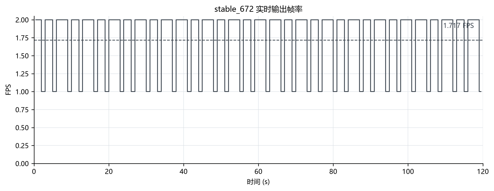
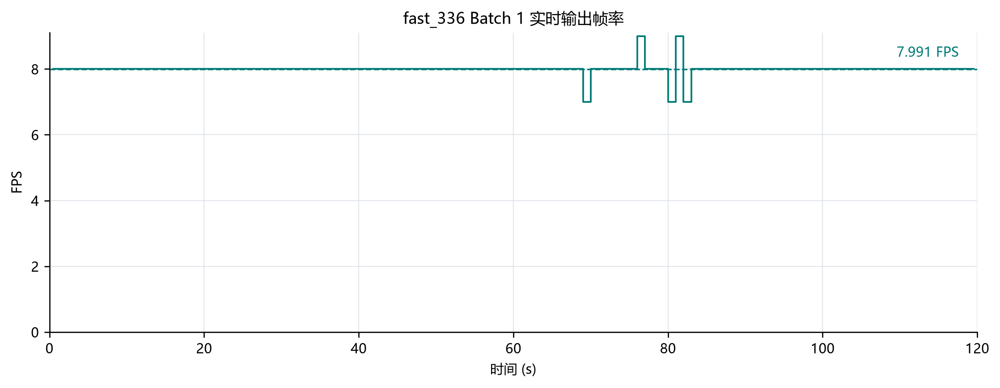
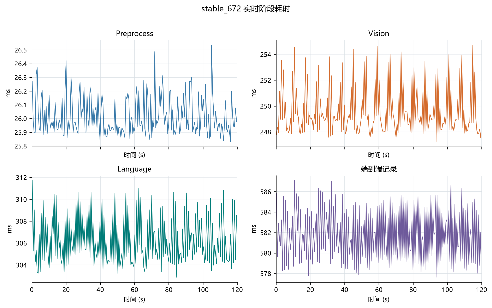
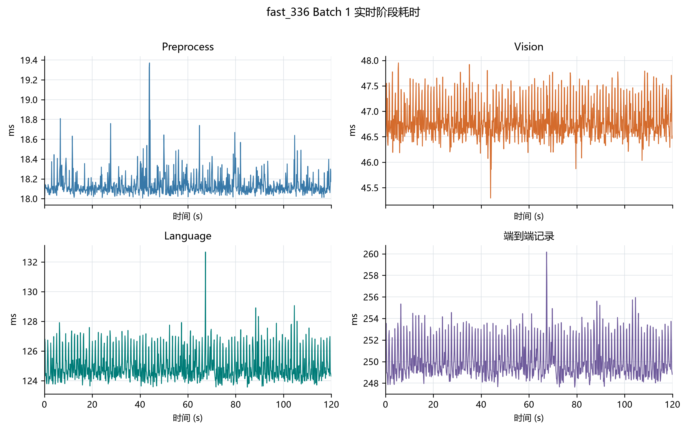
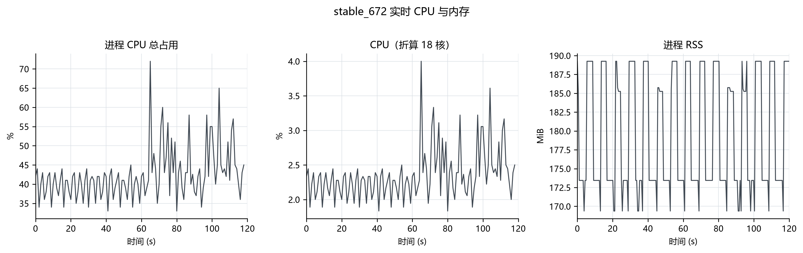
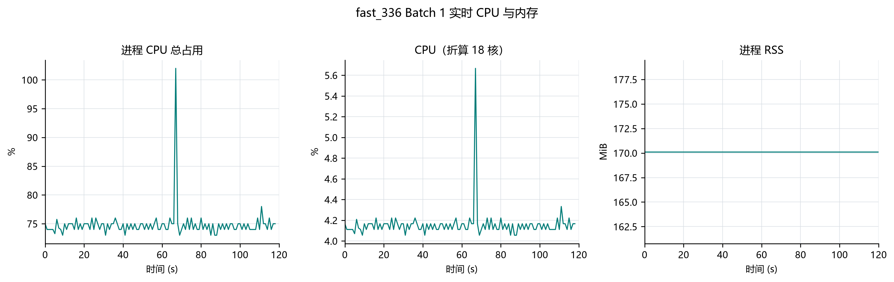
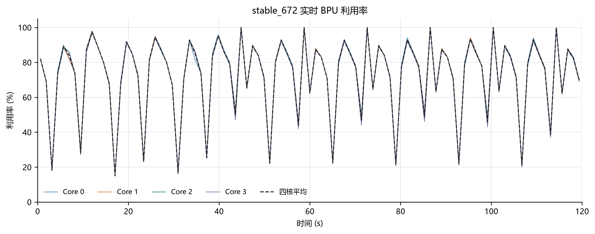
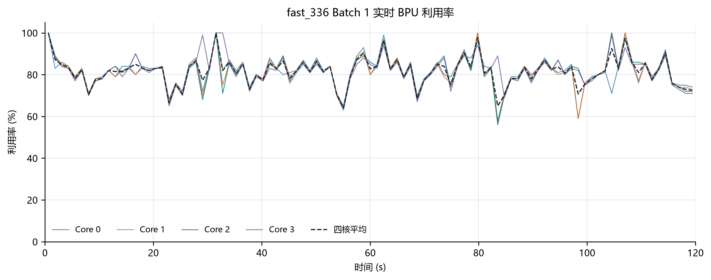
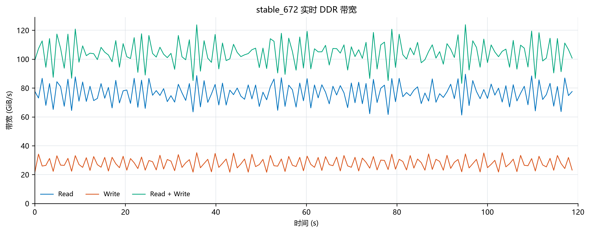
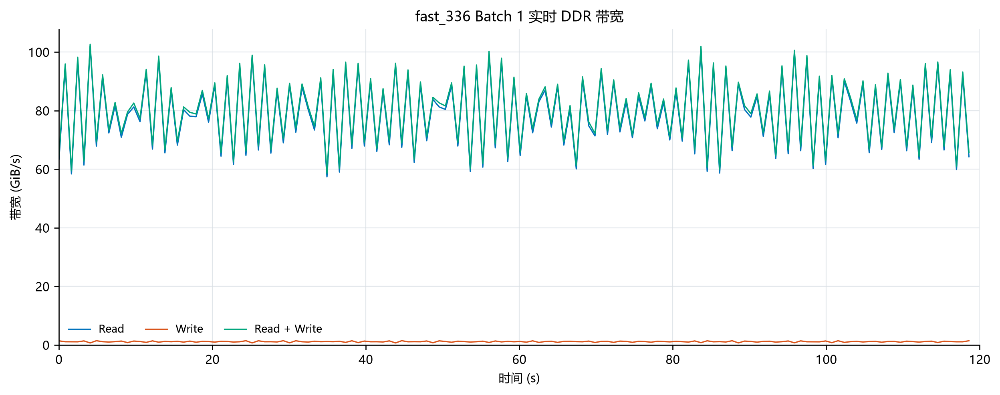

# LocateAnything fast_336 Batch 1 推理优化

## 1. 优化目标与结果

将 LocateAnything-3B 在 RDK S600 上调整至检测优先的 fast_336 配置（336×336 输入、单 Batch Language 推理），目标是在实时检测中达到 7 FPS 以上的稳定输出。

在 `/detect box`、1280×720@30 FPS 持续输入下，120 秒稳态窗口输出 **7.991 FPS**，较 stable_672 提升 **365.53%**。两组结果均为每帧 1 个 box、停止原因 `im_end`、推理错误为 0：

| 指标 | stable_672 | fast_336 Batch 1 | 变化 |
| --- | ---: | ---: | ---: |
| 输出 FPS | 1.717 | **7.991** | +365.53% |
| 有效结果 | 206 / 120 s | 959 / 120 s | +753 |
| 每帧框数 | 1 | 1 | 一致 |
| 生成 Token | 10 / 帧 | 10 / 帧 | 一致 |
| PBD 调用 | 3 / 帧 | 3 / 帧 | 一致 |
| 推理错误 | 0 | 0 | 一致 |

## 2. 编译优化

### 2.1 Vision：672×672 → 336×336

输入尺寸减半，视觉序列大幅缩短：

| 项 | stable_672 | fast_336 |
| --- | ---: | ---: |
| 图像尺寸 | 672×672 | 336×336 |
| Patch | 2304 | 576 |
| Visual Token | 576 | 144 |
| Vision 输入 / 输出 | `(1,2304,588)` / `(1,576,2048)` | `(1,576,588)` / `(1,144,2048)` |

以 `/detect box` 为例，Vision 均值由 249.56 ms 降至 46.81 ms。

### 2.2 Language 序列：Prefill 256 / KV 1024

| 参数 | 值 | 说明 |
| --- | ---: | --- |
| Prefill | 256 | 单次预填充序列长度 |
| KV Cache | 1024 | 总上下文容量 = 256 + 768 |
| Runtime max new tokens | 768 | 运行期生成上限 |
| Calibration max new tokens | 896 | 仅校准期覆盖长输出 |
| 量化 | W8A8 | 独立激活 Scale |

序列长度从稳定版的 1024/4096 收缩，Prefill 与 KV 的计算量和内存随之下降。

### 2.3 Language 图优化

- **Fused Prefill**：Prefill 一次输出 7 行（1 行 AR + 6 行首轮 PBD Logits），免去原流程中单独执行首次 PBD q6 的一次图调用。
- **Compact Logits**：PBD 图只输出 6 行、AR 图只输出 1 行，去掉 Host 用不到的整行 Logits 计算与传输；KV 仍按真实 Query 长度输出。

13 张 Language 图：

| 图 | 作用 | Logits 输出 |
| --- | --- | ---: |
| prefill | 计算整段待生成上下文 | 7 行 |
| decode q6 ~ q12 | 一次并行产出 6 个决策 | 6 行 |
| decode_ar q1 ~ q5 | 单 token 自回归补足 | 1 行 |

## 3. 推理链路优化

### 3.1 两阶段流水线

Prepare（预处理 + Vision）与 Complete（Language + 采样 + 发布）拆为两个阶段，下一帧预处理和 Vision 与当前帧 Language 重叠执行：

```text
帧 N+1: 预处理 -> Vision -------------------------------┐
                                                        v
帧 N:   预处理 -> Vision -> Prefill -> PBD/AR -> 结果 → 发布
```

实测 Preprocess 18.13 ms + Vision 46.81 ms 约为 65 ms，Language 为 124.98 ms；重叠后吞吐由较慢的 Language 阶段决定，得到 7.991 FPS 输出。

### 3.2 缓存与复用

- **Prompt / Token 缓存**：同一 detection 命令（`/detect box`）的 Prompt 与 Token ID 命中后直接复用，每帧重算的部分是图像特征。
- **图像插值缓存**：摄像头分辨率不变时，缩放索引与插值权重复用，只重新读取像素。
- **Patch 缓冲移交**：预处理直接写 FP16 Patch 缓冲（576×588×2B ≈ 661 KiB），用所有权移动交给 Vision Tensor，省一次 Host 拷贝。
- **图 IO 与工作区**：HBM 图 IO、Embedding、Attention Mask、采样结算、后处理缓冲首次申请后长期复用。

### 3.3 KV Cache

- 每帧独立推理：帧首保持全零 KV，上一帧 KV 不作为下一帧上下文。
- KV 缓冲驻留设备侧，复用缓冲地址与容量；当前帧覆盖自己的有效区域。
- 每轮 Decode 只把实际接受的 KV 行写回，避免整份大块 KV 的 Host↔BPU 搬运。

## 4. S600 性能验收

### 4.1 测试条件

RDK S600（18 CPU 核，4 BPU Core），USB `/dev/video0` 1280×720@30 FPS，Prompt `/detect box`，fast_336 输入使用 336×336 stretch，WebSocket 关闭，预热 20 个结果后取 120 s 稳态窗口。DDR 使用 `hrut_ddr -t rr_all -p 20000` 直接采集，stable_672 与 Batch 1 的中位间隔分别为 812.963 ms 和 812.267 ms。

### 4.2 实时吞吐与正确性

| 指标 | stable_672 | fast_336 Batch 1 | 变化 |
| --- | ---: | ---: | ---: |
| 监控窗口 | 120.005 s | 120.006 s | - |
| 严格窗口结果 | 206 | 959 | +753 |
| 输出 FPS | 1.717 | 7.991 | +365.53% |
| 每帧框数 | 1（206/206） | 1（959/959） | 一致 |
| Stop reason | im_end（206/206） | im_end（959/959） | 一致 |
| 推理错误 | 0 | 0 | 一致 |

FPS 按 `窗口内结果数 / 窗口时长` 计算，为连续实时输出吞吐。

### 4.3 阶段耗时

| 阶段 | stable_672 均值 | stable_672 P95 | stable_672 峰值 | Batch 1 均值 | Batch 1 P95 | Batch 1 峰值 | 均值变化 |
| --- | ---: | ---: | ---: | ---: | ---: | ---: | ---: |
| Preprocess | 26.02 ms | 26.27 ms | 26.54 ms | 18.13 ms | 18.34 ms | 19.37 ms | -30.30% |
| Vision | 249.56 ms | 253.69 ms | 254.72 ms | 46.81 ms | 47.51 ms | 47.95 ms | -81.24% |
| Language | 306.21 ms | 310.35 ms | 311.72 ms | 124.98 ms | 126.98 ms | 132.67 ms | -59.19% |
| 单帧端到端记录 | 581.80 ms | 585.71 ms | 587.09 ms | 250.12 ms | 253.36 ms | 260.17 ms | -57.01% |

Vision 缩短 81.24%，Language 缩短 59.19%；Batch 1 的流水线节拍由 Language 阶段决定。

### 4.4 资源占用

| 指标 | stable_672 均值 | stable_672 P95 | stable_672 峰值 | Batch 1 均值 | Batch 1 P95 | Batch 1 峰值 | 均值变化 |
| --- | ---: | ---: | ---: | ---: | ---: | ---: | ---: |
| 进程 CPU 总占用 | 42.34% | 56.10% | 72.00% | 74.81% | 76.00% | 102.00% | +32.47 个百分点 |
| CPU（折算 18 核） | 2.35% | 3.12% | 4.00% | 4.16% | 4.22% | 5.67% | +1.80 个百分点 |
| RSS | 179.64 MiB | 189.25 MiB | 189.25 MiB | 170.12 MiB | 170.12 MiB | 170.12 MiB | -9.51 MiB |
| 四核 BPU 平均 | 72.74% | 100.00% | 100.00% | 81.64% | 93.30% | 100.00% | +8.90 个百分点 |
| DDR Read | 76.34 GiB/s | 86.71 GiB/s | 89.57 GiB/s | 79.09 GiB/s | 97.09 GiB/s | 101.97 GiB/s | +2.75 GiB/s |
| DDR Write | 27.85 GiB/s | 34.17 GiB/s | 35.18 GiB/s | 1.12 GiB/s | 1.42 GiB/s | 1.45 GiB/s | -26.73 GiB/s |
| DDR Read + Write | 104.20 GiB/s | 118.22 GiB/s | 123.88 GiB/s | 80.22 GiB/s | 98.14 GiB/s | 102.65 GiB/s | -23.98 GiB/s |
| ION `ion_uncache` Heap | 302.06 MiB | 302.06 MiB | 302.06 MiB | 302.06 MiB | 302.06 MiB | 302.06 MiB | 0.00 MiB |

进程 CPU 100% 表示占用一个 CPU 核；CPU（折算 18 核）为前一项除以 18。ION 为系统全局 Heap，不与进程 RSS 相加。

### 4.5 时序图





















## 5. 结论

- fast_336 Batch 1 在实时 `/detect box` 下输出 7.991 FPS，959/959 帧结果正确，较 stable_672 提升 365.53%。
- Vision 和 Language 均值分别缩短 81.24% 和 59.19%，端到端记录缩短 57.01%。
- DDR Read + Write 均值由 104.20 GiB/s 降至 80.22 GiB/s，RSS 降低 9.51 MiB；进程 CPU 总占用增加 32.47 个百分点。
