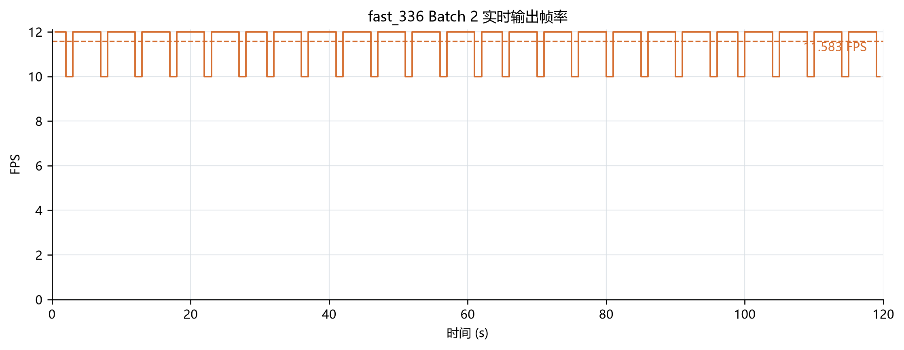
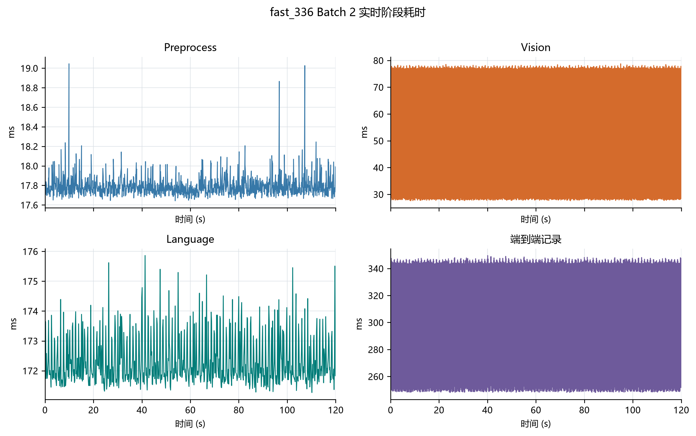
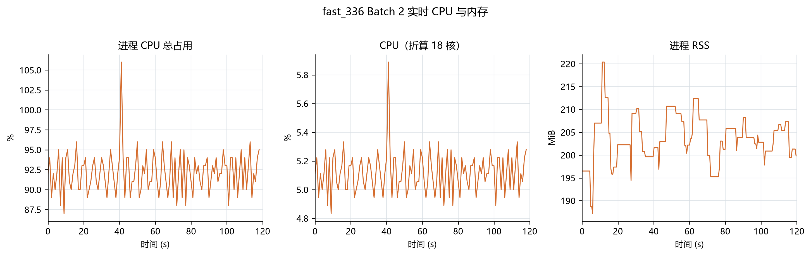
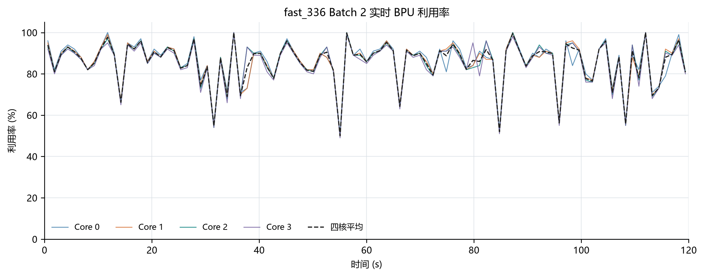
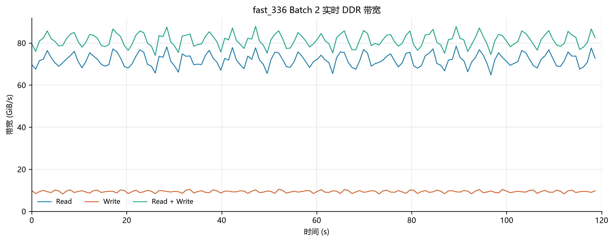

# LocateAnything fast_336 Batch 2 推理优化

## 1. 优化目标与结果

Batch 1（单 Batch）基础上，将 Language 图改为静态 Batch 2：每次 Language 图调用并行推进两帧的生成，目标是让一帧的等待成本由两帧摊薄，提升实时输出吞吐。

在 `/detect box`、1280×720@30 FPS 持续输入下，120 秒稳态窗口输出 **11.583 FPS**，较 Batch 1 提升 **44.94%**，正确性完全一致（每帧 1 box、`im_end`、0 推理错误）：

| 指标 | Batch 1 | Batch 2 | 变化 |
| --- | ---: | ---: | ---: |
| 输出 FPS | 7.991 | **11.583** | +44.94% |
| 有效结果 | 959 / 120 s | 1390 / 120 s | +431 |
| Language 图周期 | 959 | 695（每周期 2 结果） | - |
| 每帧框数 | 1 | 1 | 一致 |
| 生成 Token | 10 / 帧 | 10 / 帧 | 一致 |
| PBD 调用 | 3 / 帧 | 3 / 帧 | 一致 |
| 推理错误 | 0 | 0 | 一致 |

## 2. 编译优化

沿用 Batch 1 的 fast_336 编译优化（见 《08_batch1_inference_optimization.md》第 2 节），差异仅在 Language 图：

### 2.1 Language 静态 Batch 2

13 张 Language 图的输入、Logits、KV 输出统一增加 Batch 维度：

```text
Batch 1: (1, Query, Hidden) -> (1, LogitsRows, Vocab)
Batch 2: (2, Query, Hidden) -> (2, LogitsRows, Vocab)
```

| 参数 | Batch 2 |
| --- | ---: |
| Image | 336×336，stretch |
| Vision 输入 / 输出 | `(1,576,588)` / `(1,144,2048)` FP16 |
| Language Batch | 2 |
| Prefill / KV Cache | 256 / 1024 |
| Runtime max new tokens | 768 |
| PBD / AR | q6 / q1 |
| Fused Prefill / Compact Logits | enabled（Logits 7 / 6 / 1 行） |
| 量化 | W8A8 独立 Scale |
| BPU Core | 4 |

两条 Lane 各持独立 Prompt、生成 Token、PBD/AR 状态与 KV Cache；Fused Prefill 与 Compact Logits 的 7/6/1 ABI 与 Batch 1 一致。

### 2.2 编译产物

| 产物 | 大小 |
| --- | ---: |
| Language HBM (336, batch2) | 3,860,727,064 Byte |
| Vision HBM (336) | 491,258,184 Byte |

13/13 HBO 编译完成，ABI 校验通过（batch=2, prefill=256, cache=1024, fused/compact, logits=7/6/1）。

## 3. 推理链路优化

### 3.1 两阶段流水线

同 Batch 1：Prepare（预处理 + Vision）与 Complete（Language + 采样 + 发布）拆开，下一帧 Prepare 与当前批次 Language 重叠。Batch 2 下 Prepare 需要为两条 Lane 各准备一帧 Vision 特征后一起提交。

### 3.2 缓存与复用

Batch 1 的缓存/复用全部保留：Prompt/Token 缓存、插值索引权重复用、FP16 Patch 缓冲所有权移交（省 661 KiB 拷贝）、图 IO 与 Embedding/Mask/采样工作区复用、Preprocess 零 KV。

### 3.3 KV Cache

- 每条 Lane 独立 KV 状态：帧首全零，各自覆盖自己的有效区域，帧间不复用语义。
- 设备侧缓冲驻留，每轮 Decode 只写回实际接受的 KV 行。

### 3.4 双 Lane 调度

Prepare 逐帧产出 Vision 特征，凑齐两帧后一次提交给静态 Batch 2 Language 图：

```text
Frame A -> 预处理 -> Vision -> Lane 0 ┐
                                      ├-> Language Batch 2 -> Result A + Result B
Frame B -> 预处理 -> Vision -> Lane 1 ┘
```

本轮日志示例（一次 Language 周期发布两条结果，共享同一次执行时间）：

```text
frame_id=480 ... language_ms=175.688 ... boxes=1
frame_id=483 ... language_ms=175.688 ... boxes=1
```

两条结果共享同一次 BPU 执行，权重读取摊薄到两帧，是吞吐提升的主要来源；两条 Lane 的图像、Token、KV 与输出框保持独立。

## 4. S600 性能验收

### 4.1 测试条件

RDK S600（18 CPU 核，4 BPU Core），USB `/dev/video0` 1280×720@30 FPS，Prompt `/detect box`，模型输入 336×336 stretch，WebSocket 关闭，预热 20 个结果后取 120 s 稳态窗口。DDR 使用 `hrut_ddr -t rr_all -p 20000` 直接采集，Batch 1 与 Batch 2 的中位间隔分别为 812.267 ms 和 812.404 ms。

### 4.2 实时吞吐与正确性

| 指标 | Batch 1 | Batch 2 | 变化 |
| --- | ---: | ---: | ---: |
| 监控窗口 | 120.006 s | 120.005 s | - |
| 严格窗口结果 | 959 | 1390 | +431 |
| 输出 FPS | 7.991 | 11.583 | +44.94% |
| Language 图周期 | 959 | 695 | - |
| 每周期结果 | 1 | 2 | +1 |
| 每帧框数 | 1（959/959） | 1（1390/1390） | 一致 |
| Stop reason | im_end（959/959） | im_end（1390/1390） | 一致 |
| 推理错误 | 0 | 0 | 一致 |

窗口结束后约 4 ms 的 2 个结果不计入（避免边界竞态高估吞吐）。

### 4.3 阶段耗时

| 阶段 | Batch 1 均值 | Batch 1 P95 | Batch 1 峰值 | Batch 2 均值 | Batch 2 P95 | Batch 2 峰值 | 均值变化 |
| --- | ---: | ---: | ---: | ---: | ---: | ---: | ---: |
| Preprocess | 18.13 ms | 18.34 ms | 19.37 ms | 17.79 ms | 17.97 ms | 19.05 ms | -1.91% |
| Vision | 46.81 ms | 47.51 ms | 47.95 ms | 52.73 ms | 77.84 ms | 78.75 ms | +12.64% |
| Language | 124.98 ms | 126.98 ms | 132.67 ms | 172.33 ms | 173.93 ms | 175.86 ms | +37.88% |
| 单帧端到端记录 | 250.12 ms | 253.36 ms | 260.17 ms | 297.41 ms | 346.83 ms | 349.63 ms | +18.90% |

Batch 2 的 Language 为一次双 Lane 批调用的执行周期，同时产出两帧结果；因此输出 FPS 按 120 秒窗口结果数计算，不与单帧记录时延互为倒数。

### 4.4 资源占用

| 指标 | Batch 1 均值 | Batch 1 P95 | Batch 1 峰值 | Batch 2 均值 | Batch 2 P95 | Batch 2 峰值 | 均值变化 |
| --- | ---: | ---: | ---: | ---: | ---: | ---: | ---: |
| 进程 CPU 总占用 | 74.81% | 76.00% | 102.00% | 92.13% | 95.10% | 106.00% | +17.32 个百分点 |
| CPU（折算 18 核） | 4.16% | 4.22% | 5.67% | 5.12% | 5.28% | 5.89% | +0.96 个百分点 |
| RSS | 170.12 MiB | 170.12 MiB | 170.12 MiB | 203.70 MiB | 212.38 MiB | 220.38 MiB | +33.58 MiB |
| 四核 BPU 平均 | 81.64% | 93.30% | 100.00% | 85.64% | 97.15% | 100.00% | +4.00 个百分点 |
| DDR Read | 79.09 GiB/s | 97.09 GiB/s | 101.97 GiB/s | 71.93 GiB/s | 76.88 GiB/s | 78.51 GiB/s | -7.16 GiB/s |
| DDR Write | 1.12 GiB/s | 1.42 GiB/s | 1.45 GiB/s | 9.40 GiB/s | 10.20 GiB/s | 10.50 GiB/s | +8.28 GiB/s |
| DDR Read + Write | 80.22 GiB/s | 98.14 GiB/s | 102.65 GiB/s | 81.33 GiB/s | 86.32 GiB/s | 87.91 GiB/s | +1.11 GiB/s |
| ION `ion_uncache` Heap | 302.06 MiB | 302.06 MiB | 302.06 MiB | 302.06 MiB | 302.06 MiB | 302.06 MiB | 0.00 MiB |

Batch 2 的总带宽均值仅增加 1.11 GiB/s，吞吐提升来自双 Lane 摊薄 Language 图调用成本；代价是 CPU、RSS 和 DDR Write 上升。

### 4.5 时序图
















## 5. 结论

- fast_336 Batch 2 在实时 `/detect box` 下输出 11.583 FPS，1390/1390 帧结果正确，较 Batch 1 提升 44.94%。
- 代价为进程 CPU 总占用增加 17.32 个百分点、RSS 增加 33.58 MiB、DDR Write 增加 8.28 GiB/s；单帧端到端记录增加，但整体输出吞吐更高。
- 适用：连续实时检测、吞吐优先场景；资源极敏感的场景仍用 Batch 1。
