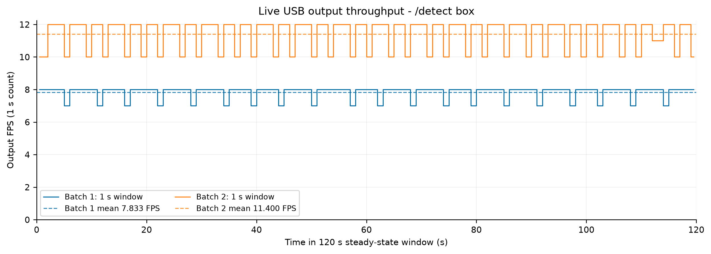
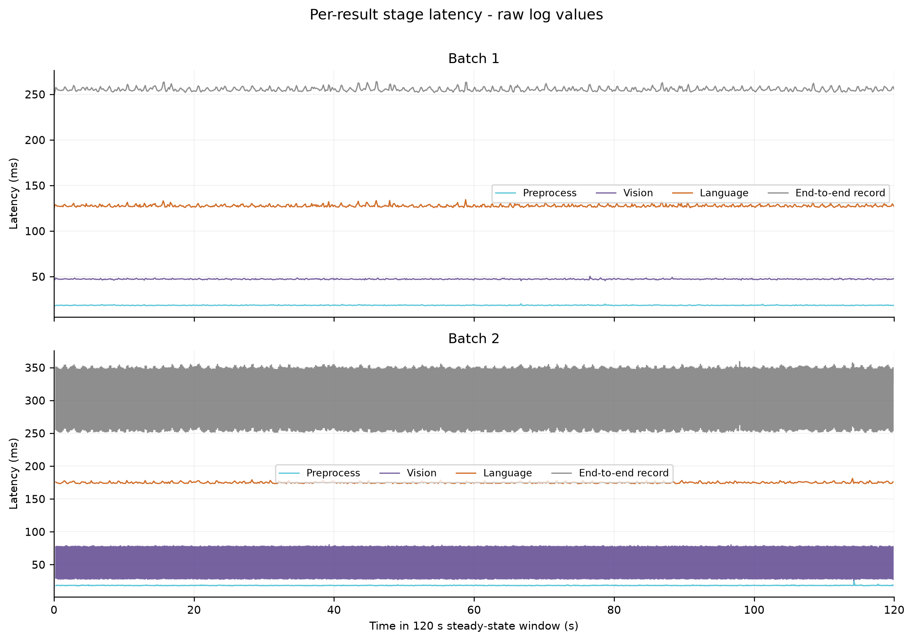
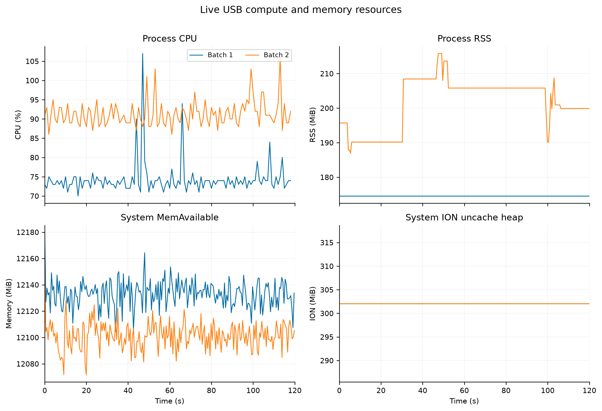
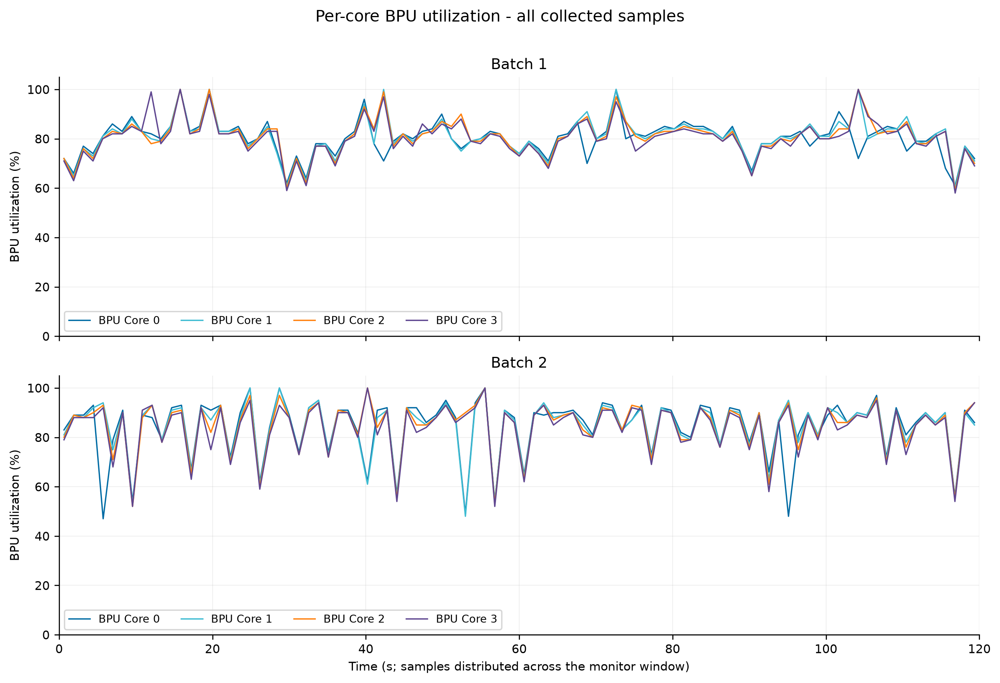
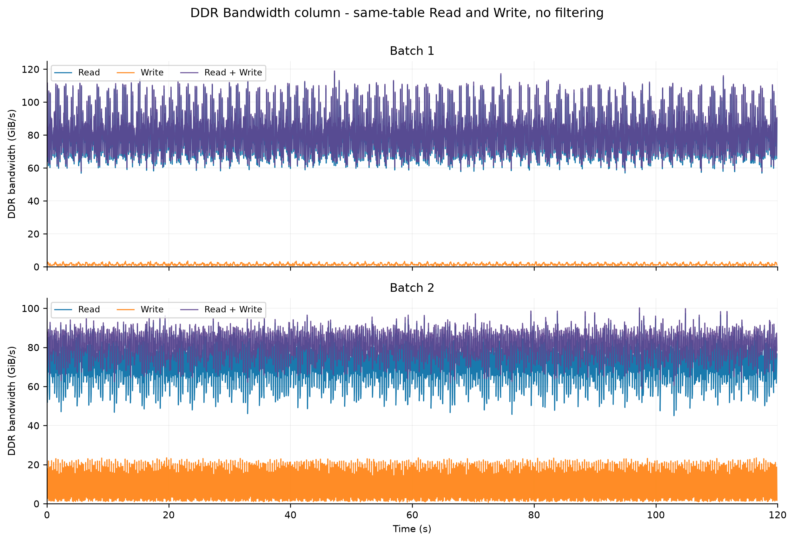

# LocateAnything fast_336 Batch 2 实时推理说明

## 1. 范围与结论

Batch 2 将两帧独立的 Vision Feature 组成一个 Language Batch，通过一次 Language 图调用并行推进两条生成状态。本轮使用与 Batch 1 完全相同的实时 USB 输入和 `/detect box` Prompt，在 S600 上进行 120 秒稳态对比。

严格监控窗口内，Batch 1 输出 940 个结果、7.833 FPS；Batch 2 输出 1368 个结果、11.400 FPS，实时吞吐提升 **45.53%**。两轮结果均为每帧 1 个 `box`、10 个生成 Token、3 次 PBD 调用和 `im_end`，推理错误为 0。

| 指标 | Batch 1 | Batch 2 | 变化 |
| --- | ---: | ---: | ---: |
| 输出 FPS | 7.833 | **11.400** | **+45.53%** |
| 严格窗口结果 | 940 | 1368 | +428 |
| Language 图周期 | 940 | 684 | -256 |
| 每周期结果 | 1 | 2 | +100% |

## 2. 编译

### 2.1 配置

Batch 2 沿用 fast_336 的图像尺寸、序列长度、PBD/AR 结构和 W8A8 量化策略，Language 图的静态 Batch 维度设为 2。

| 参数 | 值 |
| --- | --- |
| 图像尺寸 | 336×336 |
| Resize | `stretch` |
| Vision 输入 / 输出 | `(1,576,588)` / `(1,144,2048)` FP16 |
| Language Batch | 2 |
| Prefill | 256 |
| KV Cache | 1024 |
| Runtime max new tokens | 768 |
| PBD / AR | q6 / q1 |
| Compact Logits | Prefill 7 行、PBD 6 行、AR 1 行 |
| Fused Prefill | enabled |
| 量化 | fast_336 W8A8 独立 Scale |
| BPU Core | 4 |

编译配置：

```text
Locateanything_PTQ/compiler/config/fast_336_batch2.yaml
```

### 2.2 Language 图契约

13 张 Language 图的输入、Logits 和 KV 输出统一带 Batch 维度：

```text
Batch 1: (1, Query, Hidden) -> (1, LogitsRows, Vocab)
Batch 2: (2, Query, Hidden) -> (2, LogitsRows, Vocab)
```

每个 Lane 拥有独立 Prompt、生成 Token、PBD/AR 状态和 KV Cache。Fused Prefill 与 Compact Logits 的 7/6/1 行 ABI 保持一致。

### 2.3 编译产物

| 产物 | 大小 | SHA256 |
| --- | ---: | --- |
| `LocateAnything-3B_language_336x336.hbm` | 3,860,727,064 Byte | `c25860d16e8761b5032b7f06211a7aff3d6d21e5d9beb33a71171b0b050ddf68` |
| `LocateAnything-3B_vision_336x336.hbm` | 491,258,184 Byte | `0f476272b0442d2457e772a158697eb340484db0f4e43724cbe7a2100947a090` |

Language 编译完成 13/13 HBO，13 图 ABI 校验为 `batch=2 prefill=256 cache=1024 fused_prefill=true compact_logits=true logits=7/6/1`。

## 3. 推理

### 3.1 Batch 调度

Prepare 阶段逐帧完成预处理和 Vision；Prepared 队列凑齐两帧后，一次提交给静态 Batch 2 Language HBM：

```text
Frame A -> Preprocess -> Vision -> Lane 0 ┐
                                          ├-> Language Batch 2 -> Result A + Result B
Frame B -> Preprocess -> Vision -> Lane 1 ┘
```

例如本轮 `/detect box` 日志中，一次 Language 周期会连续发布两个结果：

```text
frame_id=480 ... language_ms=175.688 ... boxes=1
frame_id=483 ... language_ms=175.688 ... boxes=1
```

两条结果共享同一次 Language 执行时间，同时保留各自的图像、Vision Feature、Token、KV 和输出框。

### 3.2 复用的 fast_336 推理优化

1. 下一帧 Prepare 与当前批次 Language 重叠。
2. Prompt、Token ID 和固定输入尺寸的缩放索引、插值权重复用。
3. FP16 Patch 缓冲直接交给 Vision Tensor。
4. HBM 图 IO、Embedding、Mask、采样和后处理工作区复用。
5. 每个 Lane 使用独立 KV 状态；设备缓冲区持续复用，每帧写入自身有效区域。
6. Prefill 直接提供首个 PBD 窗口，PBD/AR 图只输出运行时需要的 logits 行。

## 4. 实时 USB 对比

### 4.1 测试条件

| 项目 | Batch 1 | Batch 2 |
| --- | --- | --- |
| 平台 | RDK S600 | RDK S600 |
| 输入 | USB `/dev/video0`，1280×720，30 FPS | 相同 |
| ROS 输入 | `/hbmem_img` 共享内存 | 相同 |
| Prompt | `/detect box` | `/detect box` |
| 模型输入 | 336×336，`stretch` | 336×336，`stretch` |
| WebSocket | disabled | disabled |
| 预热 | 20 个结果 | 20 个结果 |
| 稳态窗口 | 120 s | 120 s |
| Language SHA256 | `ad4a861b...326e8` | `c25860d...ddf68` |

执行入口：

```bash
bash /home/sunrise/LA_LIVE_BOX_COMPARE_20260818/benchmark_live_usb.sh batch1 120 20
bash /home/sunrise/LA_LIVE_BOX_COMPARE_20260818/benchmark_live_usb.sh batch2 120 20
```

### 4.2 正确性与吞吐

| 指标 | Batch 1 | Batch 2 | 变化 |
| --- | ---: | ---: | ---: |
| 监控窗口 | 120.004311 s | 120.004834 s | +0.000523 s |
| 脚本结束计数 | 940 | 1370 | +430 |
| 严格时间窗结果 | 940 | 1368 | +428 |
| 输出 FPS | 7.833 | **11.400** | **+45.53%** |
| Language 周期 | 940 | 684 | -27.23% |
| 每周期结果 | 1 | 2 | +100% |
| 每帧框数 | 1 | 1 | 一致 |
| 生成 Token | 10/帧 | 10/帧 | 一致 |
| PBD 调用 | 3/帧 | 3/帧 | 一致 |
| Stop reason | `im_end` | `im_end` | 一致 |
| 推理错误 | 0 | 0 | 一致 |

Batch 2 脚本结束计数中的最后 2 个结果位于 `monitor_end` 之后约 4 ms。正式 FPS 与阶段统计使用严格时间窗内的 1368 个结果，避免边界竞态高估吞吐。



图中每个点是固定 1 秒窗口内的真实结果数量：Batch 1 稳定在 7～8 FPS，Batch 2 稳定在 10～12 FPS。虚线为完整监控窗口均值，曲线未做平滑。

### 4.3 阶段均值对比

| 指标 | Batch 1 | Batch 2 | 变化 |
| --- | ---: | ---: | ---: |
| Preprocess | 18.525 ms | 18.212 ms | -1.69% |
| Vision | 47.234 ms | 52.966 ms | +12.13% |
| Language | 127.570 ms | 174.807 ms | +37.03% |
| Postprocess | 0.015 ms | 0.010 ms | -31.63% |
| 单帧端到端记录 | 255.350 ms | 301.923 ms | +18.24% |
| 输出 FPS | 7.833 | 11.400 | +45.53% |

Batch 2 的 Language 值是一次批调用的执行周期，同一周期产生两个结果。`total_ms` 是单条结果从进入流水线到发布的记录时延，包含排队和重叠；输出 FPS 直接由 120 秒窗口的结果数量计算，两者不互相倒数。

### 4.4 阶段耗时分布

| 版本 | 阶段 | 均值 | 中位数 | P95 | 峰值 | 样本 |
| --- | --- | ---: | ---: | ---: | ---: | ---: |
| Batch 1 | Preprocess | 18.525 ms | 18.498 ms | 18.944 ms | 20.216 ms | 940 |
| Batch 1 | Vision | 47.234 ms | 47.192 ms | 47.897 ms | 50.366 ms | 940 |
| Batch 1 | Language | 127.570 ms | 127.213 ms | 129.834 ms | 134.395 ms | 940 |
| Batch 1 | Postprocess | 0.015 ms | 0.014 ms | 0.016 ms | 0.062 ms | 940 |
| Batch 1 | 单帧端到端记录 | 255.350 ms | 254.827 ms | 259.056 ms | 263.942 ms | 940 |
| Batch 2 | Preprocess | 18.212 ms | 18.181 ms | 18.581 ms | 26.695 ms | 1368 |
| Batch 2 | Vision | 52.966 ms | 52.480 ms | 78.371 ms | 80.164 ms | 1368 |
| Batch 2 | Language | 174.807 ms | 174.433 ms | 177.315 ms | 181.145 ms | 1368 |
| Batch 2 | Postprocess | 0.010 ms | 0.015 ms | 0.018 ms | 0.046 ms | 1368 |
| Batch 2 | 单帧端到端记录 | 301.923 ms | 304.976 ms | 352.648 ms | 358.983 ms | 1368 |



Batch 2 图中的 Vision 和端到端时延呈两条稳定带：每批第一条结果包含等待第二个 Lane 准备完成的时间，第二条结果共享已经完成的批次，因此两条 Lane 的日志值不同。

## 5. 资源占用

### 5.1 均值、P95 与峰值

`MemAvailable` 的“峰值/最低值”列取最低值，表示测试期间最小剩余内存；其余指标取最大值。

| 指标 | Batch 1 均值 | Batch 1 P95 | Batch 1 峰值/最低值 | Batch 2 均值 | Batch 2 P95 | Batch 2 峰值/最低值 | 均值变化 |
| --- | ---: | ---: | ---: | ---: | ---: | ---: | ---: |
| Process CPU | 74.28% | 79.00% | 107.00% | 91.31% | 97.00% | 106.00% | +17.03 个百分点 |
| Process CPU（折算 18 核整机容量） | 4.13% | 4.39% | 5.94% | 5.07% | 5.39% | 5.89% | +0.95 个百分点 |
| RSS | 174.56 MiB | 174.56 MiB | 174.56 MiB | 201.64 MiB | 208.44 MiB | 215.81 MiB | +27.08 MiB |
| VmHWM | 174.69 MiB | 174.69 MiB | 174.69 MiB | 211.13 MiB | 215.81 MiB | 215.81 MiB | +36.44 MiB |
| VSZ | 8056.94 MiB | 8056.94 MiB | 8057.50 MiB | 8613.11 MiB | 8613.19 MiB | 8613.75 MiB | +556.17 MiB |
| MemAvailable | 12133.22 MiB | 12147.30 MiB | 12104.50 MiB | 12101.55 MiB | 12115.84 MiB | 12071.62 MiB | -31.66 MiB |
| BPU Core 0 | 80.31% | 90.30% | 100.00% | 84.22% | 95.00% | 100.00% | +3.92 个百分点 |
| BPU Core 1 | 80.97% | 95.80% | 100.00% | 84.45% | 95.00% | 100.00% | +3.48 个百分点 |
| BPU Core 2 | 80.75% | 94.20% | 100.00% | 84.61% | 94.70% | 100.00% | +3.86 个百分点 |
| BPU Core 3 | 80.33% | 95.60% | 100.00% | 83.74% | 94.00% | 100.00% | +3.42 个百分点 |
| Four-core BPU 平均 | 80.59% | 92.12% | 100.00% | 84.26% | 94.01% | 100.00% | +3.67 个百分点 |
| DDR Read | 78.91 GiB/s | 107.18 GiB/s | 117.25 GiB/s | 71.81 GiB/s | 88.46 GiB/s | 97.64 GiB/s | -7.10 GiB/s |
| DDR Write | 1.42 GiB/s | 2.65 GiB/s | 3.53 GiB/s | 9.55 GiB/s | 21.84 GiB/s | 23.52 GiB/s | +8.13 GiB/s |
| DDR Read + Write | 80.33 GiB/s | 108.23 GiB/s | 118.96 GiB/s | 81.36 GiB/s | 91.28 GiB/s | 100.26 GiB/s | +1.03 GiB/s |
| ION `ion_cma` Heap | 0.00 MiB | 0.00 MiB | 0.00 MiB | 0.00 MiB | 0.00 MiB | 0.00 MiB | 0.00 MiB |
| ION `ion_uncache` Heap | 302.06 MiB | 302.06 MiB | 302.06 MiB | 302.06 MiB | 302.06 MiB | 302.06 MiB | 0.00 MiB |

Process CPU 中 100% 表示占满一个 CPU Core；折算值表示该进程占整机 18 核理论容量的比例。ION Heap 是系统全局共享堆，RSS 与 VmHWM 是 `hobot_locateanything` 进程指标。

### 5.2 时序图







三张图使用完整原始点：CPU 为 119 点，Memory/ION 为 223 点，BPU 为 Batch 1 95 点和 Batch 2 94 点，DDR 为 Batch 1 2388 张配对表和 Batch 2 2370 张配对表。DDR Read、Write 与 Read+Write 来自同一时刻的 `Bandwidth` 列，零值和峰值全部保留，曲线未平滑。

### 5.3 DDR 采样间隔

| 指标 | Batch 1 | Batch 2 |
| --- | ---: | ---: |
| 配对表数量 | 2388 | 2370 |
| 实际间隔均值 | 50.228 ms | 50.610 ms |
| 实际间隔 P95 | 51.428 ms | 52.309 ms |
| 实际间隔峰值 | 58.943 ms | 57.531 ms |

Batch 2 的 DDR Read 均值下降 7.10 GiB/s，Write 均值上升 8.13 GiB/s，总带宽均值只增加 1.03 GiB/s。吞吐提升主要来自一次 Language 图周期并行产出两帧结果，而不是扩大 DDR 总流量。

## 6. 版本与复核路径

| 项目 | 分支 | 提交 |
| --- | --- | --- |
| `Locateanything_PTQ` | `fast_336` | `ea21ce6` |
| `hobot_locateanything` | `fast_336` | `61e2f2b` |

S600 原始数据：

```text
/home/sunrise/LA_LIVE_BOX_COMPARE_20260818/results/batch1
/home/sunrise/LA_LIVE_BOX_COMPARE_20260818/results/batch2
```

本地原始数据与统计产物：

```text
assets/live_box_compare/resource_comparison_summary.json
assets/live_box_compare/summary_tables.md
assets/live_box_compare/data/
```

Batch 2 模型：

```text
/home/sunrise/LA_TEST_336/install/lib/hobot_locateanything/models/LocateAnything-3B_language_336x336.hbm
SHA256 c25860d16e8761b5032b7f06211a7aff3d6d21e5d9beb33a71171b0b050ddf68
```

## 7. 结论

fast_336 Batch 2 在实时 USB `/detect box` 场景达到 11.400 FPS，较 Batch 1 的 7.833 FPS 提升 45.53%。代价是 Process CPU 均值增加 17.03 个百分点、RSS 均值增加 27.08 MiB、DDR Write 均值增加 8.13 GiB/s；四核 BPU 均值提高 3.67 个百分点，DDR 总带宽均值仅增加 1.03 GiB/s。所有严格窗口结果保持 1 框、10 Token、3 次 PBD 和 `im_end`，本轮没有推理失败。
